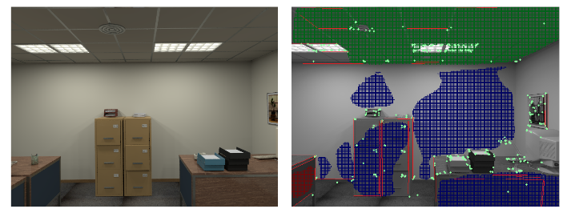

# Structure-SLAM
Structure-SLAM is a real-time monocular SLAM library that computes the camera trajectory and a sparse 3D reconstruction based on the assumption of Manhattan World. We provide examples to run the system in the [TUM RGB-D dataset](http://vision.in.tum.de/data/datasets/rgbd-dataset) and [ICL NUIM dataset](https://www.doc.ic.ac.uk/~ahanda/VaFRIC/iclnuim.html). 

​            

# 1. License

Structure-SLAM is released under a [GPLv3 license](https://github.com/raulmur/StructureSLAM/blob/master/License-gpl.txt). For a list of all code/library dependencies (and associated licenses), please see [Dependencies.md](https://github.com/raulmur/StructureSLAM/blob/master/Dependencies.md).

# 2. Prerequisites
We have tested the library in **Ubuntu 12.04**, **14.04** and **16.04**, but it should be easy to compile in other platforms. A powerful computer (e.g. i7) will ensure real-time performance and provide more stable and accurate results.

## C++11 or C++0x Compiler
We use the new thread and chrono functionalities of C++11.

## Pangolin
We use [Pangolin](https://github.com/stevenlovegrove/Pangolin) for visualization and user interface. Dowload and install instructions can be found at: https://github.com/stevenlovegrove/Pangolin.

## OpenCV
We use [OpenCV](http://opencv.org) to manipulate images and features. Dowload and install instructions can be found at: http://opencv.org. **Required at leat 2.4.3. Tested with OpenCV 2.4.11 and OpenCV 3.2**.

## Eigen3
Required by g2o (see below). Download and install instructions can be found at: http://eigen.tuxfamily.org. **Required at least 3.1.0**.

## DBoW2 and g2o (Included in Thirdparty folder)
We use modified versions of the [DBoW2](https://github.com/dorian3d/DBoW2) library to perform place recognition and [g2o](https://github.com/RainerKuemmerle/g2o) library to perform non-linear optimizations. Both modified libraries (which are BSD) are included in the *Thirdparty* folder.

# 3. Building ORB-SLAM2 library and examples

Clone the repository:
```
git clone https://github.com/raulmur/StructureSLAM.git StructureSLAM
```

We provide a script `build.sh` to build the *Thirdparty* libraries and *ORB-SLAM2*. Please make sure you have installed all required dependencies (see section 2). Execute:
```
cd StructureSLAM
chmod +x build.sh
./build.sh
```

This will create **libORB_SLAM2.so**  at *lib* folder and the executables **mono_tum**, **mono_kitti**, **rgbd_tum**, **stereo_kitti**, **mono_euroc** and **stereo_euroc** in *Examples* folder.

# 4. Monocular Examples

## TUM Dataset

1. Download a sequence from http://vision.in.tum.de/data/datasets/rgbd-dataset/download and uncompress it.

2. Execute the following command. Change `PATH_TO_SEQUENCE_FOLDER`to the uncompressed sequence folder.
```
./Examples/Structure-SLAM Vocabulary/ORBvoc.txt Examples/TUMX.yaml PATH_TO_SEQUENCE_FOLDER
```

## Acknowledgements

We thank [Raul Mur-Artal](https://github.com/raulmurfor) for his impressive work, [**ORB-SLAM**](https://github.com/raulmur/ORB_SLAM). 
