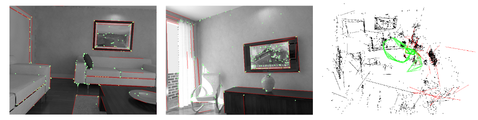

# PL SLAM
This platform provide a real-time monocular SLAM method that computes the camera trajectory and a sparse 3D reconstruction by leveraging point (ORB) and line (LSD) features. We provide examples to run the system on the [ICL NUIM dataset](https://www.doc.ic.ac.uk/~ahanda/VaFRIC/iclnuim.html).  

If you are interested in more structure information about indoor SLAM, we command you to check our [PlanarSLAM](https://github.com/yanyan-li/PlanarSLAM) that proposes ManhattanWorld/VanishingDirection and other modules.  

​       

# 1. License 

PL-SLAM is released under a [GPLv3 license](https://github.com/raulmur/StructureSLAM/blob/master/License-gpl.txt). For a closed-source version of Structure-SLAM(PL) for commercial purposes, please contact me yanyan.li at tum.de 

# 2. Prerequisites
We have tested the library in **Ubuntu** **16.04**, but it should be easy to compile in other platforms. A powerful computer (e.g. i7) will ensure real-time performance and provide more stable and accurate results.

## C++11 or C++0x Compiler
We use the new thread and chrono functionalities of C++11.

## Pangolin
We use [Pangolin](https://github.com/stevenlovegrove/Pangolin) for visualization and user interface. Dowload and install instructions can be found at: https://github.com/stevenlovegrove/Pangolin.

## OpenCV
We use [OpenCV](http://opencv.org) to manipulate images and features. Dowload and install instructions can be found at: http://opencv.org. **Required at least 2.4.3. Tested with OpenCV 3.4.0**.

## Eigen3
Required by g2o (see below). Download and install instructions can be found at: http://eigen.tuxfamily.org. **Required at least 3.1.0**.

## DBoW2 and g2o (Included in Thirdparty folder)
We use modified versions of the [DBoW2](https://github.com/dorian3d/DBoW2) library to perform place recognition and [g2o](https://github.com/RainerKuemmerle/g2o) library to perform non-linear optimizations. Both modified libraries (which are BSD) are included in the *Thirdparty* folder.

# 3. Test PL-SLAM

## Download and build

We provide a script `build.sh` to build the *Thirdparty* libraries and *Structure-SLAM*. Please make sure you have installed all required dependencies (see section 2). Execute:
```
cd Structure-SLAM
chmod +x build.sh
./build.sh
```

## Run on ICL NUIM dataset

1. Download [ICL NUIM dataset](https://www.doc.ic.ac.uk/~ahanda/VaFRIC/iclnuim.html) and uncompress it to PATH_TO_SEQUENCE_FOLDER
2. Execute the following command. 

```
./Examples/Structure-SLAM Vocabulary/ORBvoc.txt Examples/ICL.yaml PATH_TO_SEQUENCE_FOLDER
```

## 4. Related work

This platform is a part of  [Structure-SLAM](https://arxiv.org/pdf/2008.01963.pdf), please cite it if you use the repo in an academic work.

```
@inproceedings{Li2020SSLAM,
  author = {Li, Yanyan and Brasch, Nikolas and Wang, Yida and Navab, Nassir and Tombari, Federico},
  title = {Structure-SLAM: Low-Drift Monocular SLAM in Indoor Environments},
  year = {2020},
  booktitle = {IEEE/RSJ International Conference on Intelligent Robots and Systems (IROS)},
 }
```

# Acknowledgements

We thank [Raul Mur-Artal](https://github.com/raulmurfor) for his impressive work, [**ORB-SLAM2**](https://github.com/raulmur/ORB_SLAM), which is a completed feature-based SLAM system.   

